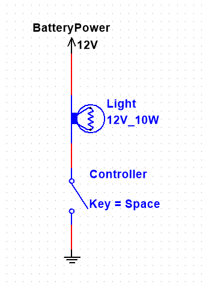

# RD400

ONLY PASS 12V ON THE 12V INPUT PIN, any other pins will BURN THE CONTROLLER.

Project files are available at [https://github.com/SquareWheelBike/RD400](https://github.com/SquareWheelBike/RD400).

## Final Assembly Notes

- DigiKey sent the wrong opto-isolators, so there is **no electrical isolation on the inputs.** This means, **if 12V is passed to any of the inputs, it *will* fry the controller**. The optocoupler safeties are currently disabled.
- All of the inputs and outputs are **active low**. This means:
- Inputs treat a 'ground' signal as 'button pressed'
- Outputs are **grounding**, so lights are grounded to turn them on.

### In case of RFID Failure

A button was added on the controller in case of RFID unit failure. If, on controller startup, the button is held, it will **toggle** the use of an RFID unit.

When RFID is enabled, the controller will toggle power based on the RFID unit. If the controller is powered on expecting an RFID unit, and the RFID unit is not detected, the controller will lock up until it is restarted with an RFID unit, or the override button.

When RFID is disabled, the POWER_ON output will always be turned on. Remember, this is a *sinking* control. Connect it to the negative side of the main power relay.

## Wiring

An example of the wiring for a light (for outputs):

In this example, the controller acts like the switch, grounding the 'output' to turn it on. Referring to this as an "output" is counterintuitive, as current is drained from the light rather than being drawn to it.

Similarly, with the inputs, when the input pins are grounded, this is interpreted as a 'button pressed' event.

ANYTHING OVER 5V ON THE INPUT PINS WILL BURN THE CONTROLLER.

## Electronics Tray

In the [sketchup](sketchup/) folder, you can find the .stl files for 3d printing the electronics tray. The outlets for wires are modular, so we can swap them out for different types and volumes of wires.

The tray has a top-mounted window, on the lid, so the electronics can be seen inside.

The design for the PCB was crated in EasyEDA.

## The Arduino

The arduino is necessary, since the pushbuttons on the handlebar are momentary push buttons, rather than latching push buttons. Making a latching circuit may have been a trivial affair, but we wanted the ability to expand features in the future. An arduino allows for this kind of modularity.

Arduino code can be viewed in [src/main.ino](src/main.ino).

## NFC

### Recognized Tags

| Tag         | Description |
| ----------- | ----------- |
| 7A B3 2D 68 | FOB 1       |
| BA 60 22 68 | FOB 2       |
| 95 AB A0 EE | CARD 1      |

### RJ45 PIN MAPPING

| RJ45 | Arduino | MFRNC | Description    |
| ---- | ------- | ----- | -------------- |
| 1    | 10      | SDA   | SPI SS         |
| 2    | 15      | SCK   | SPI SCK        |
| 3    | 16      | MOSI  | SPI MOSI       |
| 4    | 14      | MISO  | SPI MISO       |
| 5    | -       | RQ    | *Unused*       |
| 6    | -       | GND   | *Ground*       |
| 7    | 9       | RST   | RST            |
| 8    | -       | Vcc   | 2.9V regulated |

### 3.3V Power

The 3.3V for the NFC was actually 2.9V, since the MFRNC522 can run anywhere between 2.5V and 3.3V.

### Assembly

Electrical assembly notes are under the [res](res/) folder
